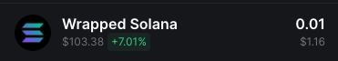

PUMPFun Onchain program ID 6EF8rrecthR5Dkzon8Nwu78hRvfCKubJ14M5uBEwF6P
Possible Pump Fun Accounts:
GRE82dsMmescpTtDaiXaWcDhvsQJHwi3zrDoxUXHojFJ

      
      
      
      
      
      
      
      
      
      
      const poolAccountInfo = await this.connection.getAccountInfo(new PublicKey(poolKeys.id.toString()));
      if (!poolAccountInfo) {
        console.log(`❌ No pool data found for ${accountId}`);
        return null;
      } 
      const newPoolData = LIQUIDITY_STATE_LAYOUT_V4.decode(poolAccountInfo.data);
      const newPoolKeys: LiquidityPoolKeysV4 = createPoolKeys(accountId, newPoolData, market);

0:48:49.338] DEBUG: Error confirming buy transaction
    
    error: {
      "type": "Error",
      "message": "y.pubkey.toBase58 is not a function",
      "stack":
          Error: y.pubkey.toBase58 is not a function
              at _Logger.makeError (/Users/darrenreed/Library/Mobile Documents/com~apple~CloudDocs/Documents/Dev/tradingbot/backend/node_modules/@raydium-io/raydium-sdk/dist/index.js:862:19)
              at _Logger.throwError (/Users/darrenreed/Library/Mobile Documents/com~apple~CloudDocs/Documents/Dev/tradingbot/backend/node_modules/@raydium-io/raydium-sdk/dist/index.js:871:16)
              at /Users/darrenreed/Library/Mobile Documents/com~apple~CloudDocs/Documents/Dev/tradingbot/backend/node_modules/@raydium-io/raydium-sdk/dist/index.js:1234:24
              at Generator.throw (<anonymous>)
              at rejected (/Users/darrenreed/Library/Mobile Documents/com~apple~CloudDocs/Documents/Dev/tradingbot/backend/node_modules/@raydium-io/raydium-sdk/dist/index.js:58:29)
              at process.processTicksAndRejections (node:internal/process/task_queues:95:5)
      "reason": "failed to simulate for instructions",
      "code": "RPC_ERROR"
    }

error: failed to get recent blockhash: TypeError: fetch failed
    at Connection.getLatestBlockhash (/Users/darrenreed/Library/Mobile Documents/com~apple~CloudDocs/Documents/Dev/tradingbot/backend/node_modules/@solana/web3.js/src/connection.ts:4699:13) {stack: 'Error: failed to get recent blockhash: TypeEr…es/@solana/web3.js/src/connection.ts:4699:13)', message: 'failed to get recent blockhash: TypeError: fetch failed'}
message =
'failed to get recent blockhash: TypeError: fetch failed'
stack =
'Error: failed to get recent blockhash: TypeError: fetch failed\n    at Connection.getLatestBlockhash (/Users/darrenreed/Library/Mobile Documents/com~apple~CloudDocs/Documents/Dev/tradingbot/backend/node_modules/@solana/web3.js/src/connection.ts:4699:13)'
[[Prototype]] =
Object
constructor =
ƒ Error()
arguments =
ƒ ()
caller =
ƒ ()
prepareStackTrace =
undefined
stackTraceLimit =
10
captureStackTrace =
ƒ captureStackTrace()
arguments =
ƒ ()
caller =
ƒ ()
length =
2
name =
'captureStackTrace'
[[Prototype]] =
ƒ ()
[[Scopes]] =
Scopes[0]
length =
1
name =
'Error'
prototype =
{constructor: ƒ, name: 'Error', message: '', toString: ƒ}
[[Prototype]] =
ƒ ()
[[Scopes]] =
Scopes[0]
message =
''
name =
'Error'
toString =
ƒ toString()
arguments =
ƒ ()
)

ROUTINE IN RADIUM-SDK CAUSING ERROR:

    try {
      results = yield simulateTransaction(connection, transactions, batchRequest);
      if (results.find((i) => i.err !== null)) throw Error("rpc simulateTransaction error");
    } catch (error) {
      if (error instanceof Error) {
        return logger2.throwError("failed to simulate for instructions", Logger.errors.RPC_ERROR, {
          message: error.message
        });
      }
    }

BATCH REQUEST:  true

TRANSACTIONS:
'[
  {
    "recentBlockhash": null,
    "feePayer": "RaydiumSimuLateTransaction11111111111111111",
    "nonceInfo": null,
    "instructions": [
      {
        "keys": [
          {
            "pubkey": "22amBVCHPF1JgF181jxrNe5nDwg6Ta3NEh8n2QvRpump",
            "isSigner": false,
            "isWritable": false
          },
          {
            "pubkey": "5Q544fKrFoe6tsEbD7S8EmxGTJYAKtTVhAW5Q5pge4j1",
            "isSigner": false,
            "isWritable": false
          },
          {
            "pubkey": "CF4NVRe8G4vxNdMxJZWMkWKkTYiqPjLZcuq7r9CPMNiL",
            "isSigner": false,
            "isWritable": false
          },
          {
            "pubkey": "7ud8NkvwU55poHas6iLdxBUmFB2yPD9ToLLTQNvGz6cz",
            "isSigner": false,
            "isWritable": false
          },
          {
            "pubkey": "5C8ofzffQ7Rf4386N4RmUbEFFKcvFJURU9ATiXvvuQaY",
            "isSigner": false,
            "isWritable": false
          },
          {
            "pubkey": "FtNy9xwLmFLXp5NFJsF2cUgDnWwnQEoM4JaDWkTjaXyR",
            "isSigner": false,
            "isWritable": false
          },
          {
            "pubkey": "CFkcYFxUNFZmAHMxs7govoqbcsHS5QQ5c5oo2pToKZ79",
            "isSigner": false,
            "isWritable": false
          },
          {
            "pubkey": "E1JTNDs5DH9wyP2XvUWMFxzoUCnR31sKDBPpWiA3zWHW",
            "isSigner": false,
            "isWritable": false
          }
        ],
        "programId": "675kPX9MHTjS2zt1qfr1NYHuzeLXfQM9H24wFSUt1Mp8",
        "data": [
          12,
          0
        ]
      }
    ],
    "signers": []
  }
]'

CONNECTION:
ionSignatures: Array(0), simulatedSignatures: Array(0)}
_commitment =
'confirmed'
_confirmTransactionInitialTimeout =
undefined
_disableBlockhashCaching =
false
_nextClientSubscriptionId =
4
_pollingBlockhash =
false
_rpcBatchRequest =
requests => {\n    return new Promise((resolve, reject) => {\n      // Do nothing if requests is empty\n      if (requests.length === 0) resolve([]);\n      const batch = requests.map(params => {\n        return client.request(params.methodName, params.args);\n      });\n      client.request(batch, (err, response) => {\n        if (err) {\n          reject(err);\n          return;\n        }\n        resolve(response);\n      });\n    });\n  }
_rpcClient =
ClientBrowser {options: {…}, callServer: ƒ}
_rpcEndpoint =
'https://mainnet.helius-rpc.com/?api-key=d4a0e249-aecd-4f2f-9e05-a0985a90650a'
_rpcRequest =
(method, args) => {\n    return new Promise((resolve, reject) => {\n      client.request(method, args, (err, response) => {\n        if (err) {\n          reject(err);\n          return;\n        }\n        resolve(response);\n      });\n    });\n  }
_rpcWebSocket =
RpcWebSocketClient {_events: Events, _eventsCount: 10, address: 'wss://mainnet.helius-rpc.com/?api-key=d4a0e249-aecd-4f2f-9e05-a0985a90650a', rpc_id: 6, queue: {…}, …}
_rpcWebSocketConnected =
true
_rpcWebSocketGeneration =
0
_rpcWebSocketHeartbeat =
Timeout {_idleTimeout: 5000, _idlePrev: TimersList, _idleNext: TimersList, _idleStart: 1320578, _onTimeout: ƒ, …}
_rpcWebSocketIdleTimeout =
null
_rpcWsEndpoint =
'wss://mainnet.helius-rpc.com/?api-key=d4a0e249-aecd-4f2f-9e05-a0985a90650a'
_subscriptionCallbacksByServerSubscriptionId =
{4444308: Set(1), 4700341: Set(1)}
_subscriptionDisposeFunctionsByClientSubscriptionId =
{0: ƒ, 1: ƒ}
_subscriptionHashByClientSubscriptionId =
{0: '["logsSubscribe",[{"mentions":["7YttLkHDoNj9wyD…X4eqaYcHQqtj2G5"]},{"commitment":"confirmed"}]]', 1: '["programSubscribe",["TokenkegQfeZyiNwAJbNbGKPF…c5qqe5tP","encoding":"base58","offset":32}}]}]]'}
_subscriptionsAutoDisposedByRpc =
Set(0) {size: 0}
_subscriptionsByHash =
{["logsSubscribe",[{"mentions":["7YttLkHDoNj9wyDur5pM1ejNaAvT9X4eqaYcHQqtj2G5"]},{"commitment":"conf…, ["programSubscribe",["TokenkegQfeZyiNwAJbNbGKPFXCWuBvf9Ss623VQ5DA",{"commitment":"confirmed","encod…}
_subscriptionStateChangeCallbacksByHash =
{}
commitment =
ƒ commitment() {\n    return this._commitment;\n  }
getBlockHeight =
async commitmentOrConfig => {\n        const {\n          commitment,\n          config\n        } = extractCommitmentFromConfig(commitmentOrConfig);\n        const args = this._buildArgs([], commitment, undefined /* encoding */, config);\n        const requestHash = fastStableStringify(args);\n        requestPromises[requestHash] = requestPromises[requestHash] ?? (async () => {\n          try {\n            const unsafeRes = await this._rpcRequest('getBlockHeight', args);\n            const res = superstruct.create(unsafeRes, jsonRpcResult(superstruct.number()));\n            if ('error' in res) {\n              throw new SolanaJSONRPCError(res.error, 'failed to get block height information');\n            }\n            return res.result;\n          } finally {\n            delete requestPromises[requestHash];\n          }\n        })();\n        return await requestPromises[requestHash];\n      }
rpcEndpoint =
ƒ rpcEndpoint() {\n    return this._rpcEndpoint;\n  }

   try {
      results = yield simulateTransaction(connection, transactions, batchRequest);
      if (results.find((i) => i.err !== null)) throw Error("rpc simulateTransaction error");
    } catch (error) {
      if (error instanceof Error) {
        return logger2.throwError("failed to simulate for instructions", Logger.errors.RPC_ERROR, {
          message: error.message
        });
      }
    }

        const raydiumAccount = '5Q544fKrFoe6tsEbD7S8EmxGTJYAKtTVhAW5Q5pge4j1'; // Raydium Swap Account
        const preTokenBalances = parsedTransaction.meta.preTokenBalances || [];
        const postTokenBalances = parsedTransaction.meta.postTokenBalances || [];
        const baseMintBase58 = new PublicKey(tokenMint).toBase58();
        const quoteMintBase58 = new PublicKey(quoteMint).toBase58();

        // Map balances by accountIndex
        const balanceChanges = postTokenBalances.map((postBalance) => {
          const preBalance = preTokenBalances.find((pre) => pre.owner === postBalance.owner);
          const preAmount = preBalance?.uiTokenAmount.uiAmount || 0;
          const postAmount = postBalance.uiTokenAmount.uiAmount || 0;
          const decimals = postBalance.uiTokenAmount.decimals; // Extract decimals

          return {
            transactionSignature: signature,
            account: postBalance.owner,
            mint: postBalance.mint,
            change: postAmount - preAmount, // Net change
            preAmount,
            postAmount,
            decimals, // Include decimals for calculations
          };
        });

// *********  End the ballacnce changes method
      
        /* const baseVaultBase58 = new PublicKey(baseVault).toBase58();
        const quoteVaultBase58 = new PublicKey(quoteVault).toBase58();
      
        // Extract inner instructions
        const innerInstructions = parsedTransaction.meta.innerInstructions || [];

        // Filter for transfer instructions involving the baseVault and quoteVault
        const baseVaultTransfers = innerInstructions
          .flatMap((inner) => inner.instructions)
          .filter((instruction) => 
            instruction.parsed?.type === 'transfer' &&
            (instruction.parsed.info.destination === baseVaultBase58|| instruction.parsed.info.source === baseVaultBase58)
          );

        const quoteVaultTransfers = innerInstructions
          .flatMap((inner) => inner.instructions)
          .filter((instruction) =>
            instruction.parsed?.type === 'transfer' &&
            (instruction.parsed.info.destination === quoteVaultBase58 || instruction.parsed.info.source === quoteVaultBase58)
          );

        console.log('Base Vault Transfers:', baseVaultTransfers);
        console.log('Quote Vault Transfers:', quoteVaultTransfers);

        // Calculate net changes for baseVault and quoteVault
        const baseVaultChange = baseVaultTransfers.reduce((sum, instruction) => {
        const amount = parseFloat(instruction.parsed.info.amount);
        return instruction.parsed.info.destination === baseVaultBase58 ? sum + lamportsToReadable(amount, baseDecimals) : sum - lamportsToReadable(amount, baseDecimals);
        }, 0);

        const quoteVaultChange = quoteVaultTransfers.reduce((sum, instruction) => {
        const amount = parseFloat(instruction.parsed.info.amount);
        return instruction.parsed.info.destination === quoteVaultBase58 ? sum + lamportsToReadable(amount, quoteDecimals) : sum - lamportsToReadable(amount, quoteDecimals);
        }, 0);
        console.log('Base Vault Change (Inner Instructions):', baseVaultChange);
        console.log('Quote Vault Change (Inner Instructions):', quoteVaultChange);

        // Determine BUY/SELL
        let txType = '';
        let txAmount = 0;
        let solAmount = 0;

        if (quoteVaultChange < 0 && baseVaultChange > 0) {
          // BUY: SOL spent, tokens received
          txType = 'BUY';
          txAmount = baseVaultChange;
          solAmount = Math.abs(quoteVaultChange);
        } else if (quoteVaultChange > 0 && baseVaultChange < 0) {
          // SELL: SOL received, tokens spent
          txType = 'SELL';
          txAmount = Math.abs(baseVaultChange);
          solBcAmount = quoteVaultChange;
        } else {
          console.log(`⚠️ Transaction ${signature} does not match a typical SWAP pattern.`);
          return;
        }

        console.log(`⚠️ Transaction ${signature} involves less than ${MIN_SOL_AMOUNT} SOL, skipping.`);

        // Filter out transactions with less than 0.1 SOL
        if (solAmount < MIN_SOL_AMOUNT) {
            console.log(`⚠️ Transaction ${signature} involves less than ${MIN_SOL_AMOUNT} SOL, skipping.`);
            return;
        }

        // Log and save the transaction
        console.log(
          `✅ Detected ${txType} - Tokens: ${txAmount} | SOL: ${Math.abs(quoteVaultChange)}`
         );
 */ 
 
 
 
 
  baseVault: '4LHHaABmpT32VC2yH9yvy1xatD74Cq1TZBKByhJ2cCa9',
  quoteVault: 'X2WxmptqY4Vd6Py2TRenQGDVctuudQzEjwURQJi1zZp',

GSn38zpKbJCXgRZZE55h39L6UrYwb7bSVzCQYghJmRvk

'F7KxPrJNjB5gYZXXiCmfbuX9hhy3f5Dh6RZD1tVtboox'
Balance Changes: [
  {
    account: '66ZC9U8y1uYaAxt4WFYVW11YZeZohvi8ev6wBHsAxykh',
    mint: 'F5zWnVVXWUvaggXx6amKSPUsgcNLdfoc6c5nGFi4pump',
    change: 3.6162748629999992,
    preAmount: 12.259252137,
    postAmount: 15.875527
  },
  {
    account: '5Q544fKrFoe6tsEbD7S8EmxGTJYAKtTVhAW5Q5pge4j1',
    mint: 'F5zWnVVXWUvaggXx6amKSPUsgcNLdfoc6c5nGFi4pump',
    change: -15.875526994466782,
    preAmount: 206899558.659373,
    postAmount: 206899542.783846
  },
  {
    account: '5Q544fKrFoe6tsEbD7S8EmxGTJYAKtTVhAW5Q5pge4j1',
    mint: 'So11111111111111111111111111111111111111112',
    change: -206898908.657933,
    preAmount: 206899558.659373,
    postAmount: 650.00144
  },
  {
    account: '66ZC9U8y1uYaAxt4WFYVW11YZeZohvi8ev6wBHsAxykh',
    mint: 'So11111111111111111111111111111111111111112',
    change: -0.00004999999999988347,
    preAmount: 12.259252137,
    postAmount: 12.259202137
  }
]

quote Vault: 'DWm54TVYsrnCZrEANwrKhKoNqq2LHqhEyiDURKvQHE1t'
              DWm54TVYsrnCZrEANwrKhKoNqq2LHqhEyiDURKvQHE1t  

'Hf34igNreSR8vSnjaqXzy2sAvoRzPrTFZDxxwGP3wNxL'

poolID: '8fzNfi8Tere5FrS5Z2bspeKimCmSgT6b8zoTxwmqkRet'
         8fzNfi8Tere5FrS5Z2bspeKimCmSgT6b8zoTxwmqkRet

✅ Latest Pool Keys: {
  baseVault: 'Hf34igNreSR8vSnjaqXzy2sAvoRzPrTFZDxxwGP3wNxL',
  quoteVault: 'DWm54TVYsrnCZrEANwrKhKoNqq2LHqhEyiDURKvQHE1t',
  baseMint: 'GtHnUS5dAfuZP7sf8gce6gj2GHJN8TMQLtHk4Vh6pump',
  quoteMint: 'So11111111111111111111111111111111111111112',
  marketId: '6v8aZ9AjvBsvbNCBpzuPrrYfWrS8c4k4Zkryrfj2ZKbx'
}
Balance Changes: [
  {
    account: 'CaShxDq2Vbdp2XryjDdUZthbTzwYsvKuH6Knn9pPi4xU',
    mint: 'GtHnUS5dAfuZP7sf8gce6gj2GHJN8TMQLtHk4Vh6pump',
    change: 0,
    preAmount: 31.750924,
    postAmount: 31.750924
  },
  {
    account: '5Q544fKrFoe6tsEbD7S8EmxGTJYAKtTVhAW5Q5pge4j1',
    mint: 'GtHnUS5dAfuZP7sf8gce6gj2GHJN8TMQLtHk4Vh6pump',
    change: 0,
    preAmount: 206899082.394623,
    postAmount: 206899082.394623
  },
  {
    account: '5Q544fKrFoe6tsEbD7S8EmxGTJYAKtTVhAW5Q5pge4j1',
    mint: 'So11111111111111111111111111111111111111112',
    change: -206898432.39173302,
    preAmount: 206899082.394623,
    postAmount: 650.00289
  },
  {
    account: '63CYzDw5c3egYrw7zvmG738qJm5PZKDvEamAfDmZYp3V',
    mint: 'GtHnUS5dAfuZP7sf8gce6gj2GHJN8TMQLtHk4Vh6pump',
    change: 0,
    preAmount: 0,
    postAmount: 0
  },
  {
    account: '63CYzDw5c3egYrw7zvmG738qJm5PZKDvEamAfDmZYp3V',
    mint: 'So11111111111111111111111111111111111111112',
    change: 0,
    preAmount: 0,
    postAmount: 0
  }

baseVault EwZkBHdigWz5AEgFQLYEvPtP6LFM9UMpXg54kzXzcCSv
quoteVault D6xL2KPcTwTEpvrykTS8D15i6B52MuKB3quKovmQmU1q

Balance Changes: [
  {
    account: '5iywveQKkidqPDKt2CExJcWKex2EXz9kbGcYiZvhuXWs',
    mint: 'EvMBFsts4ewitpEjqVJCrXrVv8obmFLSyRhUkZ1vpump',
    change: 0,
    preAmount: 2059.732348,
    postAmount: 2059.732348
  },
  {
    account: '5Q544fKrFoe6tsEbD7S8EmxGTJYAKtTVhAW5Q5pge4j1',
    mint: 'So11111111111111111111111111111111111111112',
    change: 0,
    preAmount: 90.013813816,
    postAmount: 90.013813816
  },
  {
    account: '5Q544fKrFoe6tsEbD7S8EmxGTJYAKtTVhAW5Q5pge4j1',
    mint: 'EvMBFsts4ewitpEjqVJCrXrVv8obmFLSyRhUkZ1vpump',
    change: 181653750.2904682,
    preAmount: 90.013813816,
    postAmount: 181653840.304282
  },
  {
    account: 'Djsis2GwNtPZetd4W5HEtbV3GDVMJDZ3NaFU5PP2RHEx',
    mint: 'So11111111111111111111111111111111111111112',
    change: 0,
    preAmount: 0,
    postAmount: 0
  },
  {
    account: 'Djsis2GwNtPZetd4W5HEtbV3GDVMJDZ3NaFU5PP2RHEx',
    mint: 'EvMBFsts4ewitpEjqVJCrXrVv8obmFLSyRhUkZ1vpump',
    change: 0,
    preAmount: 0,
    postAmount: 0
  },
  {
    account: '5iywveQKkidqPDKt2CExJcWKex2EXz9kbGcYiZvhuXWs',
    mint: 'So11111111111111111111111111111111111111112',
    change: -2038.299553437,
    preAmount: 2059.732348,
    postAmount: 21.432794563
  }
]

   Transaction signatures input: [
  '4kH4oAKxrrvGWdd9yvQ51WQaMfpf1HMewcZmsN8BaXSCHvNkRBZGk6xSDjMkSmJiw5oNTUMpCRughRyPA43PwDTc',
  'qFYpmF1rSLDAAobt6fpQ4npE3x7dz74t3g21HNd5v8LcofJgRD2kuMAexKrSpabke3W4yZX6dePCLwcgHDWMbKy',
  '3W9Eef3mjUxHxUGw8wJPkaybhE7dVZYFNsNTk8qA7cGiTeFuhBVH2PQioaPVy7SibAqgfdxMZ6JcXs9K7DqR5S7',
  '4AatAdtURTbJ8jugzaCDQPFQFjm3ezsLHQ4we3vtqXmZpwd7wLXURmWBCWiebd6yvz1eVYugxVJuGA9kZop8nuQk',
  '2jFdT293NurNTStWdKH6vc3qECVD4iJatKedbozL9zYhqMdXDiDmRYUtRXD8USLPjuLv7rZzfRyPBUFjeeAQ49f9',
  'P8hHnBu8DzJuRy5dfafWymmXnnPoBzeBt6sFJ7UoYie9eJzPV5HHheZ8iuHcw9ZAaBjhUaE1jKvTsF37RjBJzGH',
  '2KGjakxjrte32aV3DL8dHV385fYyTNiuWjCQ4oP4Jrpv8BtnmKiY452y2CNqqLCEQeA72H6k2vrbqnMWLGKZqLQX',
  'ANWjbvd4c35YYtvJsdQG3CxX5sV3vfakWcmUL9Pq8XynK5rot7tyuCb7aVnqFvDEZNsJ7e4MaEYcbQtGeEciiN3',
  '2m1GKyD8wXhMLBtFAAoj5CcfEY8x77J8V3M8pVRSAdybKGbvyom3RXoaiuVJmm77fngsK1Zw8zmAiBB3UTEbPB5A',
  '3BmcExoWU6NDZdZknrFqS6iGabjpM8RdxgXMiEZcibAeXkFfPoJNfbeheHxeFiv4VG4eQg7w79cG9JrRuuQNMhom',
  '4zofiPvjh8pN9NSKxpLs8k9pzPYLfWJB1tSsj6vaDM9z9DMBwR9xVyB4ZyKPbyLmQcBebRj8RMJFVMPhnAkGoag',
  '4s47vECfso2PJ5aimBGG5j1B3b4WzarydAXEo8UXbeUPZZw9EFv8Rq2eYmSADPMmyXL64Ybwk4iqqn5vASRouMVc',
  'spCisD81JdU256w6PwMYNiMvzs6xKecefqBEDnKPCLb5Akr7ohbzSDCHR4NmHSzNoAHPUJfitgBrUYARed6U79P',
  '3qGUdWxJ6oHRbV14qpgBMSa5ZySfNFQTEN1KZe9QTFrpinrWCWingR8nsxskHL9v8MBLYeYT89Gb2u9zoZrpYn2N',
  '3uLXvV2DBwVK6MFUdbwtBwJntk34p9j3gR3ck2zL7ZM5ZBjF73foqU8Vi3AtpVnXA3C485FsxUQnBsJn45Doyx8M',
  '28KNB5gDMZcoVv3QPsWeFHZFpWmU7aAvuZt3XsufVLmt5ukegmoRqiuKvpXQ1eaK8LcVKUENDNkMorf7xVwPKuw7',
  '44J4Cn7KBFE6ZzpoEd7sJT6xwRHvXabSqv5G2TUyuAc2jAF2w6GUBS4puRSBN2UiK5rSg2q8dMyEnLXcf3uzmAdn',
  '5ebJxGjEqtSM2mhfVSgk9d64CXT63pNgebTroMp7HibtVYHvoX25h5Wn32eRGsvaM5E4HE188bHwiRPX7oBcPUuN',
  'JxESLN7q3J4rnEY4T39EzWsUyUEbqQ7eJbpeodu2CcUTYaEGt1ECseTWGhfmt9HGp97AExejuraqrnWJ29ZpXCw',
  'TYgmCHQeesbAJMzvReGiqs1yTDATDNWVdhzoGLGooajmbazUjv5mv1vAxhsm3uAZjvWqL8JxYX81d6hu2Mweqs9',
  '5i62jHgqWLGd9e74Dqpiv5FzNpQZ9uid8jWXQmy1mSy9cVMFQ3UfUabyjnFKVtEgJrSPHBgZaUHZgNzqojfdsJi3',
  '7rGqA1ffZU7kKngoReiwFcmdbNptAUKPA4KBdESTVFD4CXM1sfih9nZ7pCHJfuJcQ68qirfDjQzhrxHcZHJ9Mic',
  '46CCU4r4pQRpFVZtpKxs8GAL4kpQiLFcFSJC4Rj98TQCxKjCQQgwjRn21M4cJJrgLG2u4gypkxgdG9oiDe1BxcMN',
  '4YJBC6kXNTRbh95Ad1bX41vk9hSBou7GccC7jrP6YeuMozmfBZyTVYBg4E5KvXtMH6FZTokijBxhicM8QaHb5bbC',
  '4vz9u6HCuLgBewtFcHuVuChpLHrWKDJqKiWiXL8bSff61teLiZLvGyfV9u78vJxDmB4DnoS9cKsg55ASKBDhXSFi',
  'rvuCo9mnuSNavq8H5Kt6kBFRL4L2KaVm4XgBAKs25hCCN3QNJX8dDeEaiUGFCL8mWW564YqeacNdPpbUFdAt3pQ',
  'rXNDCE4urs6tzz9oarKAFTmhafLnhKtpRjJx4bzzc7FnaGi5RLYxmfj5Q1yAKcQCZWGtnnyQ96uYTgPjrMpbtJA',
  '5VUQFBC5monUf2W4b3GovyCr7SWqqBWr8PKXapaMbPCQve5s4QrGsn6A1ooNey1XYj68vUDsW9CeBZndgWTHWDNB',
  '5pTZKmErCcgL2s1iD9mPyCTW5KoKRykSSTGWZNTsdVRkA9TAhJPoR23pyKcSbjk633S9xneAoRG613cVdjEFHny5',
  '38AEUhkkHEjYG3tGKXepteXTpMVAbPWTGGun1a6BqALdrU2fJ4RW4s1CSaanEfP4aYpmC1u7hZBNBhvYSCpoFQmj',
  '63ndhxi7mpGgPLt6z72erjjenRAbmEAHRQd5nFx2a5HnmqJpfTGaSTvkDXjEFPfEqAA8kmcDAAkUtAxTsxNNqajn',
  '3m5miVG2Xh6qGDanDx8ZsPDMtWmVe5ui7xWZhuvNybzroR3BsyyuY2CDR1msERLYgpgVUsTRp9xnrxQ7msp9JY89',
  '3SKjatwWwRw8BaN8m2X1hhRBoNT6KyqgCpo4Qr52o2TPfdymmVaTc968u4iSYYazUhKDYeHeiBcfSkJK9rt251Kd',
  '29uMJrawFc81HGGDqhzTFeG7GdfCUtmWNHUv9q7esBowzsnd7Ewf7XY2w841PS449cCrSpvzfo2UaSmGvwcZPW3m',
  '4XcSWbCahhPrEHmkw4R2XrptZpb7yswxQPPMVK5U5Uhx32g9GgcLg9KQ6WaTFqrqXQP8M15vgc7fgif36GSoGD6P',
  '5KAPUsXGvwD2EtmNZwEJ8b3fquxfjveDxC3v6P6KSiYZrLKdyWQNc2Y9y8cJfZxi5KALJWfqvctL4w8WKGKVVRa9',
  '66eXULyAnauWq4x3i14fpqbBzf8aXmEWHgX5aggA2R9SJMUEFgJ2gTKexnnKUYY9iUdjGzBPp6Vk1Z1qg7f6awd9',
  '3iveuqC5DZmFoGReeDTKKKMBzCtSu6hfqDDN2dGUkiaxYcQMuLjmtYFPttup5HSaUhy3dM1wnHWaKB1FBFZht1A7',
  'TxDEgg8rHQEvxvmixUPXzZoN2qkA8RwwsFDsrsQyPGoN4DGP5bS6TqMYZSFX5zm8CZjfAcyKrTt8kDkWWcGTj3E',
  '21tT183427EKg8N82e6yEFoBPFhNP9DLpxbq6eUumvAc3vqVGuCXBg3FvU8fxXQuV8aCiY1xTJsoD4rawjZdrvYX',
  '4DK5pt2CLQicG9s6zYsK4G3WQLeiVTzdp65h9FrUFJ77pfpmRt9AM9jHrW2NmSbo1AuMZaGiyVizxnNajkar7orN',
  '5FzJzUBunFboxRaJTRpnhXe7Uo4SEKcT8txAMGftThKynjRZLBunx4KZfWv4edfT38cwqyjXFHcJovfKeTMXLuwW',
  '4of5kjY2JF8jCQPGTxKu1xhEKXFtNttd3Vp4TDHxacLrihrAFs947yFSqegEeg92q4q9vbvsoYUTTNWxBUVP1EVw',
  '31TeMiGV8Ef8C29oK1R2EbTCKtZ2yYuXegFt2SAx3yxfbFp8QTXvmigoCoo6UE3Fu4QLuawtb6YmrCbmzdfN2wtg',
  '4136CaSBA86YACWzbgcGTKVfPWRGfVS6Gnvh3pYfJSNaw8MK8HY98nH5mHtV4r57pQ122quzDMCdvfrNqXXUkJJe',
  'yxHnHaipzATmM8miPM2Nc96uFsQKA39Yx1wWR3N9kpejgPJsxseonqFAagXy5n7wT5GEBnkubrmDXVHbepJxhYa',
  '62egpdjoNcZvzvB5wjJZfggFNCtFzHA4AvdGEMrb5GAoe1mRXRMaszeFiqkfWrM1Q9Ysoo2hcKLw8zDEwUg4v3rN',
  '5m26dVF1tCGqS5zh4PHWtkbew18p5CJ9PfjRC1CfeW2KiusNgKMcjEte2kFGZo2DNKMnUmWVbfsB277NKpVcRtas',
  '5Vk6yZnJyXvBmw2VMFmZ8XWZHWH6gnfJuNfSNZNiuztbNKLy72P1usm6fUk3D2dYAfS712mU66TqxSShvW8pTTUh',
  '5mkGuMpo1DBHe944MhSLFXGUo7opucqTqe2TA9nSvz2cQ3XtE82jw1gwMmzXZMo98JBWQ6YCaBJW64vrzATxo9rm',
  '36jHueyy6vcZ63JaBc5sRWywpaPLu4eJAiPbNTkjJbfwGRJ2qeiorYi3jQf222WCyHYVFotXda5wuhfEkXMmnDzf',
  '5mm4d4ybLYUxdZfmCfcgKfsQCSy4j7NmwZ6sPUWLppimXf5smDZsHrDCBVHsuxyaLvouMkELHVwV6vW9SznUJJ7J',
  '2SKF2cZow8C8bzk7PCJ8b2sMKx1EtYzE3wjJjoZiuUTY2MAjM5XXnBNJNGULdiWpWnti3p9vSeuHYBeEwPskkDrH',
  '43ZLz6PMBMQ4qM6Few7ujQHwEcmHUJCeEoprzGs7CDvWKFWr2VdrNGUEWbRUVjSPPCXKukFTpEsDLEiTtTFbYLf2',
  '4iRbqfT1DJxUaeUqo8oge9x9CnQiw9hVoPLmq79gh5pnQ6NZ3g3mPfSU3evAcDLsQ4yxg3yXCn3dXsZNaXAepxJc',
  '4Yb1YzCx7L9GpTQqFAbpo7pfVwbY8T6AQArAXxKotdkRAiAxiTWuFenZ7EKcuvsWKS4kYMuMnGwaY5y7FCJT7of7',
  '5ASYy2i4mXUmxkZMxQJSPctiX5LZXdwhqNt8QQPExbxP9tf85S4e66bHfBxgCmhyUKXHwWA3KTuBkRZfabooQahT',
  'Dp2XLTNb7Qpj3msALa2bz255xxEzodD7fwMCfLHWxAxsnztmXPZUQ9ZtYxMdQyzBEXbW3VDd5bkWWTUrqAMEgAW',
  'GYELJvpCs11bvvKghPCeMSHyZGxGeYd9NmQ93joB8yrTQYBtmKMJXWJq5AFUPKinvt6zMkRYNFEoHpeL8KfCaSY',
  '3HxV2WSwDav6uXB6bEGEzavRfdNGtWerXocBjP1ZJj4vUXUbPXMVUD4ZbsX4Hyj1mEoJnhsgsgEjPkXbhrpBT1jo',
  '2ZL8ZKxXp9sUqycf1FwGwZkDUUXCwunPvJMKqJ2RuzicXKP6JmEKic35AePhQG6jJNXiHLJhfcViBwzXSATQM8iw',
  '61dGc8DJoEzHB2wKnFmx6zxPKvrTnEnDfBzLnrasz8NjAe5Vr2pghAhE1jKAT9h7vBnvstQkpwWrir8oaGuWo2hE',
  '2FcQ9QDBtogxNBwRj6PxeR2KYZcTRPMKn2GZupqqdTK6e9FMkXKFqrWpE4xbvAz2GLNzwe5Mj7e2xHceX82yvD6B',
  '4QXrckTGQuJjBC5GcuqFay4ML2Nc85YNHYQFpQ4kumKJYCDeXR4wUe7BgN4cKjpajLRZzkcYubGCrgW7iArfTKfD',
  '49Mihe5XHStxew3pMF6Mc1GFqUQKhht4GiTmxdWJe71bxUb2kAELCJ49bNffi22C7bZgs6ac9248882rK7H42pxU',
  '3hA28cQHpj3JYb4LT3HCL22Z2Gm8mh3yKZ9nDJzwYjtp9mcyDwaLkqc6nhgiDk5TTHBDAPFwdro86zysUnsD3Umo',
  '5a4XNLPmgsSj7GtH8regM1pKPtemAF4wJ8HbFkNup1XdnAfSdicDV9PKPDPbHXLjZYSNZuoQYTiTLNsrCbC1UeHU',
  'GRZ4wzh7UTGDwnwUES4CoGP4kDhQjc6JTAhXqqSCq44nfsc3fJf6dJ9u5nL7dmYd7eD3gcoK8KkyYSpZwkHwfNY',
  '7BXTMkR7XWonvm58VjLyYaPLgwocRXUkCFbwV8BoXjLbvTd279duDRt6WsEaaJ63df9DH2WEnLjUZDhMdDh4DDh',
  '3pMov3PR5GtN6DpMnd7WxdnCJ1gwJJkCq9MSJiEDFgV8kMr3yVi5gHbjvffdLRr4kCfSbWjX5RnxUb5m4MLVAqb8',
  '4BQTn1mHqn8zjN2LzpY8BqBrDvSAnzqbzWfJTQngNbPhCv3FNBSHUEFhkvYJxE9iAcRz8PeH6QyMR71tHuyQXxYn',
  '5WaoDmh5fJJcbb68f92wk9WfqnbsT1BKxXurnUKeUtkVovGV6YozFNcn3UtiuXRGJXb5LmaH2Kd6rpuKnJafUJS7',
  '31JzNWWNaNErxqMxz6HN1StSzLcnEiQCwKCc5baTgL7yknRGhWyKpbYNXjUrF11mXGVc7hjyD6B6uShNwPp4Bixi',
  'YRFHXHonGgcDvbx1Ukq1NRxt2nRN2eMjgvKiSStA8B7EsowcZrCBi2NNQM3smuK1bdKEMG6LmdY5MUjXNHe1vTZ',
  'TQubTAZ1YkVaBqXFx8eGe5HZUxFoEbLPKX5xQaYwrcmAPUAxPi5TExYzm9p9KWBGYo3K7ydZbFMVaZDibcrFu3e',
  '3s9yjT63NxDHHk4uFufZndi7USdyHxKPkqydcnm8d9k61Q4EaV1Xi6FEYepmnAZ856dS5BNXu3MiZkJGTgY6L9C6',
  '5dGmwUUWfctrPewr9NdTMrU27zBs1t6Gg1UGfzS3AvMB6jQQKyzeYYKDtsdJUH6uUDMCqMVVEoAhJ7U7ZMrTD7mU',
  'UL5TgBWLDr5WEcTNyFVPhQGgCn2jC3P7hDGr6FxxMFtd4VAk9YwSe5xbN74gQDpaeFG11U59M1misqCF8yQzWuF',
  'ykSuBzLpX6boxxT6DsqAkYaaEy7aTPTuUnEEkVT4gJErvPs9FCU3f5y4rhKDJRRWryZ6PmaXe7xLqEHPu6iDwka',
  '2MRuVQv5ViBT9sswfNNR88VcTR9hKbnUzL12aYd8TAXr9LS2G3WM7mAVivDkscnvnbq7dj8BcX8wi3BbJfLCL3Py',
  '5gxNnqhQ5FtAxTJhsk66RRMGoYqNbF3w3bXPHxTffwfVtHn3uUgUD3U26oAX2pEFZLkZvHBkQZp7BjMowBTVwegM',
  '2om5uS24ijHhZfp1VbaJzn4W41feLmp4b5q154zHb8TLjNzWtx1n7Cn3UknUPyUxrCS5msNijxVNHXNT6PKLkwnF',
  '2whUabK247nMfaJLhETU17crsR7GzqYM2JguEa2o4KA22t7QXMc6CNmzkVZV2UKEDqdXuhoejwfFcHozqUL2uTCC',
  '5zUwPdZexe4SaeJxBxoeVQJGghhWBBfHqRqn2Q1FxkjbLo6xvPX2AWkExGYKnZuqJZ7LiLVJQGM86R9ke4QSjfzE',
  'VRAGEjgFSVZmoA2sFxEydSt2Rz9pYG33B8RyZmHxpPMw5urSuxD4arXdZnRYKRJ5stgJ1tpN6KcsioR6kMek2YP',
  '2gf8Rho8uG3e5qNkY8mFqNzGHvvC6Pb6DBN5QjVb9J34LYVKfcjKJwgxpiBuWhrW4oTVBXV2bKdcZKz3s8bCMcnY',
  '3nJE5qWL2rUCDJ6Cmdxd66evSUvM32r2L9PRL2PBmQLgsUvokZPot2vNA1n9ZVxxL958E7LyQLDsiYCP3YzaUu1B',
  '3zB3r1sopFCchwNKXw3Mv4AakHHwS3KqaACmLMNA1Rn1rR5nEmsJhaBnDykyynoZj6FrK3NactXEvVH1X3HPGneW',
  '4zdiwobZ2DjGwM2yCVjwUGKXV5ZSD1K5Q8rew9dNgTjv11J9oqwsYp4m9UbJWELdVLZ6px7ycYy6QGuiEyMjbtXe',
  'PPkqAwpUmjR4ze8KuCEyknhbLYQn5wRsG1zcpzcuEBVDjy57enUhzKR5cuHcKhescSExEYRbvwS2dxUMKf8XuBS',
  'YfRo7uQuwcUpGrY7goAoUxpqaLrFt1RkU3Kgn398ptRJ5hH5SWUd2vgtrEZQ6WyGmHJfrR7yCiK2iAdbZk5Q1ZC',
  '2vMTaJrXLMcmCH8Xw7ue8JFUd2mBL5nBHkzzyWkV9ug6aCTEr7eVGAzRcSmMzJz4XjWo6fphyA2UZiPsacT9Gdah',
  '3ZfneyBoTzyz61P6S88E9pxJkRQShgWzkiWjQbz2Bq4FxXo8cb1uqQZDHebvXXSmXYnZ5h5zoCqKresWFTcrYiXq',
  '228FpFhPqXDVkRVNHbjX2pG8DwknjsPx1uAvS4hLN2cCjFtXSEH5t4eZhGSB8QSe4ptyyynr6sn4yMzijM8Xz9Ha',
  '5sKPDsZc4uCD15jfYbZ8S57uLKrvSTFFboyJLPDbcsckD5r2mqxRGcUsox6if44EoG7wG7J1owsXt456JWTUcK6x'
]
Number of transaction signatures: 95
Retrieved 82 transactions from Helius.
Response Status: 200
Response Headers: HeadersList {
  cookies: null,
  [Symbol(headers map)]: Map(17) {
    'date' => { name: 'Date', value: 'Sat, 22 Feb 2025 22:06:33 GMT' },
    'content-type' => { name: 'Content-Type', value: 'application/json' },
    'transfer-encoding' => { name: 'Transfer-Encoding', value: 'chunked' },
    'connection' => { name: 'Connection', value: 'keep-alive' },
    'cf-ray' => { name: 'CF-Ray', value: '9162489fdc8a9e68-SJC' },
    'cf-cache-status' => { name: 'CF-Cache-Status', value: 'DYNAMIC' },
    'access-control-allow-origin' => { name: 'Access-Control-Allow-Origin', value: '*' },
    'access-control-allow-headers' => { name: 'access-control-allow-headers', value: '*' },
    'access-control-allow-methods' => { name: 'access-control-allow-methods', value: '*' },
    'helius-total-latency' => { name: 'Helius-Total-Latency', value: '3396' },
    'x-amz-apigw-id' => { name: 'x-amz-apigw-id', value: 'GaCQFFsnCYcEmgg=' },
    'x-amzn-remapped-date' => {
      name: 'x-amzn-remapped-date',
      value: 'Sat, 22 Feb 2025 22:06:33 GMT'
    },
    'x-amzn-requestid' => {
      name: 'x-amzn-requestid',
      value: 'ec5434bf-a6fe-474d-9248-171f52638f8e'
    },
    'vary' => { name: 'Vary', value: 'Accept-Encoding' },
    'server' => { name: 'Server', value: 'cloudflare' },
    'content-encoding' => { name: 'Content-Encoding', value: 'gzip' },
    'alt-svc' => { name: 'alt-svc', value: 'h3=":443"; ma=86400' }
  },
  [Symbol(headers map sorted)]: null
}
⚠️ Mismatch: Expected 95, got 82.
🔍 Processing 82 transactions for 2Uy4NWVqJjE9prXnvfK3QA1X6N4Ti6a2p4db16KHpump.
   
   
   
   
   
   
   
   
   
   
   
   const payload2 = 
        [
          "2eXm32VEFqTocNxttH63AMZkVGzv6896t1oDNJY2eb3ajp8eF6nVEnEjmzQztZvJKi7v1JCLYnnhWG3sVzaCEoqY",
          "3gNC4eCcxWxdN49VsLx9kcMFUL7pnxbfP1SyYojw6ySS6pCTUsobUEprrBSjtWbWaRXpcNZjc2QRCEBLf4GKRn8b",
          "3n8b4g3iUP3JZVB2kNE12RKRkQoShLVRgbRDfxHp9cbroAXQJJTKiXfDbzQhNN3WtJjzV7ksWeDYLpvApX9YnbUg",
          "NRB7DJm2V5X2b8C8Pj4UThU57NFDEBFMSkv2TgEDHaVMz31H4Fj812z5kfv3MvCkr7TsYrrXJJpp72aEZC2nB1d",
          "66Bx4N7VrzWxcHJeSDXddWNZJjxfYG74nR3saFoQCba5t4eKDaiy1Ecoh5asSiAgzTL9UB16bY9CW1NKDofeFjBa",
          "26w5rC1mFgF4tZ62JvHvEvaLe8c26Mn3Fkv1Npeq1ba2rX8AhdDc2nNA7xJFYmmvd3qXAbvLmAW4Dur9ZL6j6qzW",
          "4Y5GpQmMvJz6z3E8zyDN8xdNDpM4sFSFsaewvpwvyQ4wfC2zgRBeeNFES8vyzpKzfbvLDXW4n2SewkihMBgLvEyp",
          "3ZUKb9uL9h2kndgfXNTBcVtpBWSis31YkJ1RzV93YFN2WddwHwCe5kSZMigdP2LyopvEgYeKq8ibURudp8EJesfp",
          "4GupA2HDbCPLsdc5zYR3SUgh2qUrWK6tZzX264qKdU1qR9aojFyBLWyMpSjKjjpoQYy75N2oCXVEptccee53335m",
          "A8XnSg3mAxtmjRzZJDFBkYuGBP7iFtL5Qk3P1oBKDqvsQxJFDJ8xSrXEVutQNimB4PMCAggxF3dyj4hvdqk69gN",
          "4iWzGvoHyEZR7Ax4SFerw2wAkE35N5Ah45eqaAMRa6iAxf461KENzmARdBydkgqa5ujqajg54uicduE9zVkoTpEm",
          "WsMDP5tXMQg5JppaR3k8YW5b6Q6tHMm21cSLW4GJbuwLYr6Tw138YxU2t5SSCUuDyp7ndU7ZvodCzNMoZAeBNGg",
          "4a6cmw8s9JY8YTDPvSyXyaCgdniGktYDFUgQdhnBWNaSA9wx2qAuYfvqW1rn8AhRZyXhm3jVf42ztrHa723EoUCy",
          "652EgV2TdAmC6CdaiNNzg5RRmM1fBzii7c51wUnrEG1Mqf4vYsFkzmnBKETQ1FYLnzfJ8RqZbSYGmEwjfRadH9Vi",
          "5wbRgpfvJmRvT5TkV5JJGdtw1C45b5VQyjnvWVf69k5TFSA38cnHmvf5bpacMQCCy5cbrVAdFu5fPWkgj5tb4GLa",
          "4fpxDqB2SLaFstCSihydsQdNkbhQnzPQ6VMUTrs6yzmFtCB3Rj9UyyeSk3ZfTS4DsSiFaha1e2rf3XpdQK6vTpks",
          "3K2WHBeptVbBq1ZKeWMF38AFUnvZiiexZPg4rCijM61UHwBnL3NPYqid9UstPBzQ8dD1yU4SV9kzFHj7UFSyjcGD",
          "2f2Z8cnUinGnSxftiqm8KBYmuCKrdznXXTHaTNbGWkbUomwhWqUgv36VZuRy43L6Bdp4siNykKCiQoFvxWT6f7Dx",
          "4fkUKdRF46PuuZTYDPPVGKG8YQ29dkzp5yMWFWriDYgR95Roefb53fKhDQ1XkhWBkpmvY6t7miAhgZjCYVpjLQUt",
          "aUM4tKYXYeLZdPw6ZXfbmbP6LmGpRLsEKj2KufYBtDT3EonavsrzonR8fkbfkpRxZMCrrR8iWhEiP7TA8J4Ai8o",
          "29MAcUUxMc5r39cdFkVaDTp5jNnA28ZmpFNPKF54eKiUSHDPYGYNE9LBZK5AgW8T9Yjsih4pfeVcHCZvTBuFmEBq",
          "5HcgZ1njE2LLEifPK21ziZpcTrbBKSBiiGxd8T99dBMXTVFiC1JWnpgcBtSCnL9YB4DvHPx3e9VSBwtPUReScsry",
          "3h14bxwHZQBhxAQrqVWFUhvrdQczCdnGrwa4SCC2wm4Pm5kX461zwkfWxt6rBxSMyvtXDEFKBVhrHaXBr1Nyjmd6",
          "2TcDim87JDvcrbuCYzrNnk6Fv4RFUCenK9jg6LWhjorEwhzwxmSkc9oYjrsnYaEZvfFsJcmfBoFwU966f166UEVo",
          "28NmuHGx68P86pziP9z1EQmi3GWTEpC5JB5puZHcWM3ZN22hx2JnAgcUCQGUC3DM8msGQZgxExuXiD6Jhi4Jix8R",
          "5RT4sVPSuNpGXPQkuDX2tBHAGa4zjDRZGq8xn6W6g2cc9hZmatWQF6UabzTquLCYQ4m4HjVXu91kJqY8r2Z28rw5",
          "5EvGVGLzx3vm9j1ptK9ifYW4bPab51gp1LhVsXZUmpzN9CyHVJLYH7R1kQ4CVVsBofeuqiVXyBihKvXHQ6MCvTcs",
          "4uXLMPhedsd7TS9fQ6UE55wV9JjUo2ipSoB4DC9oPx2bRkoWH2wNNddpoKQBuzLGXEA1rHfXYBY3HpqoVW5LJ6Wn",
          "7qSckRNpun2EwjmHHYU48deRhv5X8GGGh8J9i8D5moCafz5wCEHgPMSitDUFWUErzTP17hpzrr9i2XLaNvK5wDH",
          "3zAETZbuZVeM1X5dcZPYUNtQJDDQL7qmwxPQ4B1AjWNZ6wfhru6UiP4CCvxiUZcvLL2fwuvtpmSCtTy1WHXubVKv",
          "246pZm1drmWWXb9jxqRig93wjQMn1zEtjpVVdbbWStkjxQuVsQxzaoz9fbmMvzJ9YrmzdWUCF8xq1VybqfcC5fcG",
          "5dK8G8MVzCrVXDYPSQZvVp9h1K9kY1AnVQwS6Jtu4V7CwJQVQWf15Y6aSmfp2B2gBusGqRpbFprED3GFpnGRZfvA",
          "jqBv3DQgGe8JwgATFzwtexNzWu1XWZhvpJX8VLNP9JsrjzeP4vDGY1SMhuoYrywb2JfNyk4mAwE5yGw5SpR34hb",
          "pHwH2rZRDmdw7xMQ2nmqVAwkP39tqQ17xJcPt7TBcKsNE4r3zWqHcDFxB9oVqobsXd5eJuZVZrFXkDg1AYJ7vcB",
          "4XxNPs2nwedkx2PWe5Twt7hXnfLfYBpsi6qv1cY6YHMPYWmpEccVyKNygPyG99VKwBn6niPCfqYmefjQchGDqgo5",
          "3dMZHxJEqNAkydKM8QnjuWyAa8gwkm4tgeqojTAagdEwd1zgQZ9eKfaWPvpahzW8G3vdkDmfooK2YrJ2Fb1qjv7m",
          "3r5V4QRg5BDU6zJq3qdBUD7VDsnsRWRrs9AesXLx2aEfKyVWLLtbDdYNVp4MzVoQbXMquUcQ6W5F4xiGm4uXtyY7",
          "5QHTvzvm7odhfdTvBVJYbEpbAN99B8shtBs2KptPQengoicijVS9Cya5f5oNCiX3UuXHXGCcbL7gUoLs9jbZSFLY",
          "3FQSNcHD3Bo5oVDDdE5EsZJBfYePrCV4eSPM9aDLM5GoE1jC2pduo4kczMMW8xHRJEu8yvapde8qVXVwCRSJ5kd3",
          "2wDqjrFc8bovgP92PTVcdAZXzKitfSMiiR28YCxthfnVSUAKQgFE5mPwXL24UxM3S5AgJti5ZN5su3qWamgYq1jp",
          "563LRDG4BvKzRY4FFYN67T8HPFmYTWUEUEhnPWPoTnymjzn7Mmq9VPaGXYJkN8uFrqdFd7BERuwjdSdn7GqoKj3y",
          "GPYDQ5TJrQ9Ye5bEc1bj6iXtGVTPvBP5sx1f1STmWQrn4aBCYhSbkQ27Rkgv9ViMtxNm11RVLZCBqVHL72Xtw59",
          "57Tm7biXW4TgoHFNagV8ifiiVEnLRs7FL3HZh6PVbckRQSJM3qNzBAA9jCQ8eEKoqoXQfAfHauGP9cdD9AbXr3b3",
          "2mqMRnC5oUX4jU9Wa5qxNgWQv2GQpBY3KtEnGySBunAEEDux4gyTiWCZBoGmrBFANcMUTHhhGkDidWWJjs1zMbvD",
          "3XnyZkkmcjAB196BgKysjhAcNeoGVifwULM26dU6K4k7JQEdB5oKNMarAZnxJyVridnD8n9TmNVjxV8iejmbyZAY",
          "52aaguYkXgBpMVk4MrLV4wj8xxPY27pkEcaZLLbGcL7wAutsSk5XTmgJaNCzEd7KKWb3R51tvw1AgrP5f7YAXRM7",
          "42ks4FCZxxL7w4VRAv8YcqeeLsn96CUmefK313dHc4htqNVy8bNVBHrq447dC2Gwojeg5KLmLHg6wP7C7FzZeN69",
          "3dwvkWwTTzj9kb6cnWWMyj3KwBD54t7qDyVrMzkFvtg6VzbrtnjcXXbeZLazuLWsMGDQZjGQcuMb2YPQjqXyhSY1",
          "3rGj9g1afd8xMHpYhpteySTCuSrhTz36br78rs5hUSAyhJdPTDpM71t2nLek6L4Vp68yZtHRwmHHMuFXPyuS3gvn",
          "SsreM4WNMfQQXkwZX6yQWrPvJ6TETWen23CMb9mSrqBsLagtd5FnCZ2zibVYXQmpKHTyP5i3qXJnotPKHejqVXB",
          "8ih9ctGvaw3mbUqqe5f8hPqRte3X7WNipdc3wAVnCAnk5WLmpmjFK9K4f71PwSQkDYxa5srUVG3xb3uBuWi5c4R",
          "QAuaffkQk9soLCdRWe6a3pvqYQj2m8nYaQQEzazinuRsQ9kNT3CXYzexbGypDRRGwHX3EKZAE8ikHGvL9EC4emM",
          "5f17HU39UE83DQVNa5GxNSPKnXNt5TRoXxNrb66Qduo65UiL21wpDFRB3qbV5Lv4oWWQXq4pBEhEiJLCHvHB2i1w",
          "33LMNxeRmTW4eiVgS1rvnx14z46mCLpLSxz1okrgBP6Um1Hvbzc15qSTNCS2BVCZhAMq7H4kZ2GVae69jVckWk54",
          "bSG6XqApL2iN6WhFL8kUWAfagBwfhPk9VB3fMXNWRbNcEQsFzxFVgdqYU83n5XaRz5K6TSCeyxaTSypv2deb7nZ",
          "2mh2WfUhyspeZRWtU4akSTkpXG4uZgUjYSVbZW8Z3SzuqDsD1Kyt9nAFW9njp4JPwPHNcjLGAmm15DBT2FuuQ982",
          "463KkqYRCx1jgMk7FJQMfJ1ZDxugMkiHNJkiFHiBrYc2NJaM4qg5ewzqkTULYTWjjEDQkkEBeZLap9PoYnUjq1h",
          "34N4YgWKkR3Hszk2moH4T9fAjAPdcozevxeZC7eSTG8YzMVGHYJug2wYP6YEfyvp9J1LAEjmLFUgHp5h1Um5qTwc",
          "4eSrB1Au7p9MW6nFhA18uZvZ2Dsjgu4ZbaB8YnsU1goze2nRUgGdtwWGjSgNSwCPkRidG5U3dqBsHj5L3Ek2CYDF",
          "44zSn1iws4zi6gLzaXxRotujKsxpQVGZuvzYYu7orvUHqwDc6Swheqk4SFq9KemaS9LsjpV1LyfPSQQMMUiuSw4y",
          "3tSECNfp2qJbTDgUR3Fb5ApAdVTWHxebN3tvGQgtPNxTgZLgbihMBvw66ZRQDBiWusD4q3pwBbdz7EA3KFZgwyHi",
          "27sfUqrsWLef6rTEWJayh1xHug6TCcLxMv3KuE8bqwzfs2aj93NYKHXDKzVLsh3fQ3xUo9LpVgLKCeu6LtBfcDJe",
          "4mQwQdSvwHRz76yfKBSiKybD7WHZFLSzHLJcRW47mcEBrWWFXk8KTEwvVJAKFi2tCMvmZto5XT3s4T486EBJh3Qt",
          "J7mFZH8S1A78JUZcxfc7cr27yayjC1okJeXtnPtvMYC9juWkR12PzxXV5w3fzYHSJSKv98MKGeN3e44u8VEpUDS",
          "492fKeLZRCrmcmYgM9Ato4wsDDkgpzN9ZzTAXmgr5fdwW9H69X6aEDJWZ2owwxeaEA6Rm9tX19hrMr2scB9LiqpF",
          "2yxwQYhyFceBLw73KBpaJM6HmywHrzySHpjQNAurm8crDM2gEESP5ugvsndTDXJpD635hpCc7fxZSV2daLjiDkza",
          "xC1qsRmGYzjw55qwbXy7C5sUTTKk5iGUy97Lyk6o2GWrPVJ8XGjowxRWUZhcQ16DTZKWsDAcQrZvMyieaRcaKG4",
          "4UxCVHFchYtMfnktfwTbk4zYFfm28h92yQrBRi5GB52mGfMrMf5B94c6hzM5oEFGMtVbSUQYjYKJGESgshLMdCSP",
          "4zyGfuHVcdXvWtKa2KyQw1GjaCk8RJYMn8hPmTAV5e82RG3o9GZQKGb3ipg33LqL1DyB7PCyjJTJ8UG7b1w8di7P",
          "wybjM2RWaRmgVtRUy2QM1cMeNH9jQTRSKZszTnZuQCmu7XpLRGS74yUSGqEiB1uNQCFhHTdXrpLTiCFFZkB4kqa",
          "4es9sJAN164dGZXRaCLGqQSyqxcWVjrHu8hGYc8rEU6rrXJo18pZzEEsb3x4ppL51C1MwVBgfyeoBsDRH4GAci5u",
          "Fp5BtfBGcpxV1LyhapPbDAe5YyVGQFmZxSFUEtEnEz6J8rTwufoSWaxrqaVHwTY8DN995LvLwcsQXkix8MYwmb5",
          "2HEdFWNNnw49d2Mo8Q7BNnZN7GHmbjW4MhC7UNUreHE4g1BPg77a5BTg96NakMoAExDJKWkH2fQZZuNpa76PWYRq",
          "4LzLzQfsRNktH4in6gmDW9Qf5ifcr4oURCPBgy7wRnGLxQpUYEhpucmq3ea2ZDvj2i3p16frWVRABB2HgAi272iy",
          "5xZg5mrBQVMBX5c69pUVZKUqjQFyFKFyVRbkFSLTQ7wAZu5SWjriT165q7kKLx3CT6F1ybzVvveqdy9g1L1CHtkg"
        ]

What we know
filter out illegal and custom

QxuMVPTGvcCg2zeFChWs2YawXLnwN7WaMPUobXcpump
Total Signatures 75
error 17
"IllegalOwner" = 1                    
"ProgramFailedToComplete" = this fails
"Custom"  16                            

s3yM7FAsYzxXeQjN2Mq7AffMweCDRp8wRFYLNrDpump
Total Signatures 330
error 49
"IllegalOwner" = 13                    
"ProgramFailedToComplete" = 6
"Custom"  27  
InvalidAccountData 3        

a7SXKsX4tTcyvERQHRzPCswWAwk9F6udQX48gQCpump
Total Signatures 178
error 56
"IllegalOwner" = 1  x                  
"ProgramFailedToComplete" = 34
"Custom"  20  x
InvalidAccountData x
"ComputationalBudgetExceeded" 1    

7 =
{blockTime: 1740076985, confirmationStatus: 'confirmed', err: {…}, memo: null, signature: '62BcptHcBZhMqhQEZkpsDCGwG4q8twnyz4tBcrLFeJh…myBLoCMTLCiHgdEEJ336HdmKnu5NFxPmwxu3moUoyoX', …}
blockTime =
1740076985
confirmationStatus =
'confirmed'
err =
{InstructionError: Array(2)}
InstructionError =
(2) [4, 'IllegalOwner']
0 =
4
1 =
'IllegalOwner'
length =
2
[[Prototype]] =
Array(0)
[[Prototype]] =
Object
[[Prototype]] =
Object
memo =
null
signature =
'62BcptHcBZhMqhQEZkpsDCGwG4q8twnyz4tBcrLFeJhV2myBLoCMTLCiHgdEEJ336HdmKnu5NFxPmwxu3moUoyoX'
slot =
321962387

rjiQhcgAWtWyUYBFRBCXRg4xCYek3pY3kuw3qG6pump
const tokenPublicKey = new PublicKey('rjiQhcgAWtWyUYBFRBCXRg4xCYek3pY3kuw3qG6pump');
const signatures = await connection.getSignaturesForAddress(tokenPublicKey, { limit: FETCH_LIMIT });
const transactionSignatures = signatures.map(tx => tx.signature);
const payload = { transactions: JSON.parse(JSON.stringify(transactionSignatures)) };
const url = `https://api.helius.xyz/v0/transactions?api-key=${HELIUS_API_KEY}`;
    try {

        const response = await axios.post(url, 
            payload,
            {
                headers: { "Content-Type": "application/json" }
            }
        );
        console.log(chalk.green(`Retrieved ${response.data.length} transactions from Helius.`));

Sending payload to Helius: {
  "transactions": [
    "4RhD75ssZCQQqbz6bN5xKWwuuCJGe9h9LaejsWbaMQw8RvKXrpeKkp8MzN63kC9Gwefm3jTz3hG8JPMdW3t4N5r5",
    "2poFSVJSu7ffasA1G3AuiF1UFBKskv3pSZDBpyRjMs7kYCe6hjW7EuHzJ2LU6ZFgduHpprWvt2Kzdywh1FkhvvZm",
    "2z2xdcxdsgKLRvDBbHLf9rqTktzSVFZpyjngye3pLVtbM4Smatr8vksMQjxDYBrBGiXNaZdRczfxUjDh2iQuo6DH",
    "2BnjyR3zk7Q2pfebFjkEMNGhoGnN2bjBn82RyNWtj1DXySQawCTtkBgsgsAdr3DCBMvySeWSGd3D2kgr5BEsizkX",
    "5xvchae7YX1uo72CKebq962HACwV53NR4cKvetm8jwxJ6XJm3YWCCcAaTdKq8YjnxdCczjC1D1Pph8mTYMNf4KPD",
    "3kKsZ6KZLCAiZ8ADrULzLjayzZnHTGVL4VFHCvQz2ZnPcHqcZYLY9dCzk9LP2ixsxekqPKcTa4HryQvxStPE8fDG",
    "4aURNPdWyvVwjXmuc5z9tyrNUaYKLekBtNmjqg1Y9zYoaTerbYdVhtzKAnFo6S9Zw8SpaXRNy1Xwtjjw4kckVNkb",
    "dcWMWyeMyZpWoyJbRBU2Z7gQjUAkGdHQLJPDnCvDbFzTEEnaugJ8aU6Q5KBwKgeAEdTx41TGLsUtE7MWTgmmcvN",
    "56wVihGZWbNBcapn4LEw2qfE8iUipPcPWfJKkxue9rKtQ2kQrHjESccxMmXKhwErU87P6dRaABKqWoEFWgpW5jJv",
    "5tdaAQM7XPkiKdD76MGjQs5utZdC2AdLJLuGHpCQp8B9aeqZmX3H9ZAKgyxYoqTXoCj1cr3XKjPppAk9jXKsXWVB",
    "5GxEifjNCG9x2MacMqjmtBNqJU34sKSBkLXpZa7oyENJkxghJymP3n356cWVchaFFD5EGAjonNHoZhmtAfhTJ61J",
    "3vykKf13JbsSjGHVyPEBXfyJ3Ew5KtYxm5gKnKLF3RA56XDAm9AaCsAWYhRqJfenX9SGcHJBVgx4vHas5hURSJiN",
    "5HpLDa8oHjBEnP3XXwiSpUb8PaWg5cjhxWDbumFhxczxRVGs3AKJtjd7DNVfAmPwECjKa5fSkBTuiP3VzCXSymt2",
    "44qyU85jrEV584pYudLvAwfikpUZsXhSvQRs7gdNXbz2HZtjreP4fpknrJydUDkHp19HiRFbx5qHZ7ZXiWHjBMda",
    "QNvpGrqygbVNuN6sqpSkjQNKbiBTGwLicNJH6rKi2UrkBqHdTuzT4csFdiyjEJur9gGrfyxy1KWe5ePW1JusC2G",
    "3wWz1y5dVSpmDN7HFzUVPeMesWQ11gmpfArEpzKYTFyuViyRPqyvr5D3dpgsAPtGZ5wS4w2Jt2vhx53YyCm5RCZ2",
    "3K4ybbQWLVTTG5h18yQYMBYBq2desn1po79TPzYHkrR6YUmgSUnTi6J9xFAcb78kfSgyoKc9t8YNmWYCokGAwiKK",
    "4zDrMtwZrPj64qyBu2Tc2ViEaiA3fcnqJPmcgiZTHjhgjzYNStrakd3x6JHDdWPebsdW1GLRkpbq6iJpLUbZeRVC",
    "4qRtnPG9K5pUggq74VXLFJ7NYWzUijHM6bHvrnQqCMKpabbYrn4sJ63u7wJmqJunq9htLuZSgTFwqVRQbjZDSJoA",
    "26ptHN65VrF3KpRsGohNBZVT872x2YoJPXbZGTaQeoS97Bg8vc4EEut3Vuvf1yXYArAKManYtzx9kBRsKiDiPZpa",
    "uD6rGPxFShWWG8Yy44Wq8pGVikp8bAVH5BYyDr5WiXvn5UVXXEbgsi78gHVYX6tK2pDmAXmE5qkjsQDPEdMTxZ4",
    "5afgAL5yJDuYvx8tccMcdzr1EP5SAhX7nxATiTTwXRvdE2FYSjzcVyZHtSPM2f7ZZDjsDuYQqArYXmyEksi3JyyF",
    "2EFXfEf1B8CS9NjpoocMjvLNvaFhDnHcoFNXMXYdC9ChBaVsADsN6TADGb5s6d7rjZRpbx5EN6nWAxGrbBSwHxL6",
    "5iCA3PUAV49HeEbLenyztrq6QjHfSHZpdsbkhLngwfDx9Gx4re5GXw6F9Z1gXuqPhreByKt8LTmfrXgmqAamLKJ9",
    "wu3m7kg9yMThgAVxHNrei8qAhrhGTtnj9ZwKc4E7JvTVmFNGiwixa7XrMbjXK6JvhsaMkjSTaRnxheGPJiYGJ7S",
    "4rYc5xddwCaWw7X8jNV7kYiyNv6RQ7QahHGGAVENUifXThWXuNYEdF4kE5PsoLTagQaycEq52RFSGmWXt7Aza2aP",
    "56QZHzbCZ9VRjTs4pgDGeZ5KLvbLx74EFxrJbj8pEsbKg3zStuMC9KrMZSvfsYpwQD9cimpy6Jaw1SLsSLZ3H81i",
    "cN6w98nDFTh1msMLS16GjUGTmmdNbm5XJM213zNLgRNp38duVWYjPRHPDNqmVPeT6Z4HeNRvUwNNziY9avUUp1g",
    "5tVDdBVKf2EZDhdojdEAegPJ4YDWA7hor64J2HhLqNU8x7q9ZHEKySfTTa47N9ciA9Js3FUBqH4D6ypQrQoHXmKJ",
    "4QAY6fug7ZTh5wsXpXYYcsc58vbjzs4vQ6YtSh34ERjXT4pPGNtKKqg53dgfzEXZBtp7ZmGUBMD3KLMx3ebQ753X",
    "2P9Ug39Z3WyPgQsYg1pyA3SFuiiEzVFhukZPLPLDkjmfesEVbmbEqv61AsUPAXpVAwDTWdnFrSqxoiQDCSsaoghx",
    "4cZv6gxa6VgDNNZm7shg1FYLG3V3J6Hx1JVcEiaizwp5MREyttLcV4XZcPrmsCXADxE1GiQ2VKRP9E7nDG23Gk5u",
    "DfJ9LVaVthSusSGVwPUXDLUMSCu7mntPKoJceQN9ADSXXHxbQbhd8ThcH68ZUrNHEhmnTB9fYad66kKrrUrRjMa",
    "pZoJco8dgU9z9eYbN3FVh3qQpPg3FguyRHqHSznAY9GP6kpVLuQB2f5cYdBhBjau9VPem5KbC7X4E5ivrFjTQGt",
    "3ehEtnG2Z9ZP5jvBWmcSy9pPv6aUP7vvC7DY1zvTe2MMA6cNDsv7nfxJrpGDm9piSLCA1hUkiNN9r5sUX2F9k9Mb",
    "4ABvgH4Ykoq4duvHyT4i39SRR53BZEXYQYGwqbTSFiqei3qVKKUHRduR53DCwgbivEq3zwZ43ryLrtebaRG4XVZH",
    "4XoAi2mYcb3BfFyHL2FnKWrjKVJd9h2Givd5CnbukTALo7DEon8KqFjW6myEUPA862noNSLKGCBUDVsuF4FLtwpg",
    "3fhdqEgPwcuNbYgpMbA1QQ5FqsYCUYHMwFGJ19Zf4QymceVG8RPRLT3JNPqPMJ9WPBw4qx3RP85DHohEiH7K2kip",
    "4Ku2zJYHRNiB6rAqUEhyd73zc2WsuePC2tcPjYB7WsgcnvbHNV6XdVwbftvvn1FfKHWWg44icvdhibXi5Rexbqwe",
    "5MeUk2M3yjT3Zg4Mq94zYnmJRmRWM5FSrbD57kALxLJAaGQ8HoYrbBBzoCq4eYz2EDjCRvgc2nm3to2A64ikLDph",
    "WjUphwFHLeS48Yj2GJW1KiQ9EFDySTnxdvgx2TtNsF3ADjHcV1hdpp2FdTyAnh8MiEpmEhpKoQZRsoM2DaqH9Uq",
    "2iMTv6ciL4i4NwSr26JbFJkGCG7q8djerAJy1qhdqtkrPXj9yVXmgBZJ7BzB4HSv4DCDXBeWnphcZbzdyj1p8Lfw",
    "2AEGYZaE3z1zW571v9S27Un5pHoUBmtAhAcHouDhHDpkLyJsGtyh5VaXy7y7UbpxtpN7FvjSFbnA4m5KQZgXx5hM",
    "59UPmATyKj5Ttaui4vVqNxeVb5naVkTazeqGRRqxtVLKf7cU5dfeV1TqFdgngCGvYoJQcmz6RKLBTkLPQ9hEGXhJ",
    "57q8nmQTa18jBz3i42hRJaZKWJbEUJvK6cFnCk5HSq7iuMaG77SHa2DGXuieYmUoA6wix2PEMyJSFCw4gLnXNtV4",
    "36rRKgTNdQq2TuFCGFj8dNgAyvUMr7Hd8Mgp7wBYyzNnR6hNbivH4h7mJqhSnJLEJwiAcxFuA7xjzTJ4FbZs7D8j",
    "3j9jXnTrypnnuZTPG2jEK9eCvohM3ieN1EgTBCVMhh3m3py9DkDziEwmxqGU4bYiGE7SYg64CJ7gG5J6A898dxXq",
    "5PtDoVbNYZL5aseqtfSrhe231KNuSLDYFBQ5esfHsWwVb1y8VTVcBtfsBWgWGm8BCbNzRinNgGB9mDsRgVPxKnvt",
    "3SsXLwHpK5K4z6PWWzVJrY2QNBKhKvuCeBsowTZK4Gz51f5UqJ7HpHcbk7qUqdyQjf7PVdpPKxLXhjr3SQJpQhTW",
    "3tcUoB9DbdXC55XVWct4CPGpQw5tjCeMhfjy7UTVrsxMXhqUt5vj5umYW36UCvf3QaV26j1YcgwvYNLREPctHxjt",
    "2X7bAYBgFYhKd9bmncGXBymbqraKyP522FM4sHphHGHbMST6875GNrCZhSKFojv8Dpmd483utmqqtzrjhVhq5zQu",
    "4kEDQfBdQGM1G3nydhbwJJCsXCu5BVt6dPLT8EdMs3TbCNagP67fAbWxq5ffy8scY9A8j9xxAneRnPm5vAJ1Uze3",
    "35zXrKWY1aNDPrCVQRZuDta9Vro9NwMFDSPhMVm1xuQ4ZnSE64jvBGncXAbCA8ytdfQ8ikEy5ERy68QuxTyiRjya",
    "4JG4WNPqPKf5RL43MSkDeVKjATg3m6tppp97Xc51Q5FUhTgfxqA39ig77PYrD83difm43y1TmmkDa5KcnogbkeCb",
    "2rzbDthBRDEBFrR6zJgV5gv5Q1dyzFXaLuJZPtWdT2mbRQYeWVybP6uQs6vhVruND6U6qGqXKrchmj7VJ4wG36qs",
    "4NY11jsUiPktNhSFGDRXCkh44w6FjsCx6jxhcr5vrX6x4f4Mkm9A9aegDeU2zMqJTs1VuZTXKgWXdDeQhTzakiV4"
  ]
}
🔄 Attempt 1/5 - Sending request to Helius...
Retrieved 49 transactions.
Mismatch detected! Expected 56, got 49. Retrying...
🔄 Attempt 2/5 - Sending request to Helius...
Retrieved 50 transactions.
Mismatch detected! Expected 56, got 50. Retrying...
🔄 Attempt 3/5 - Sending request to Helius...
Retrieved 53 transactions.
Mismatch detected! Expected 56, got 53. Retrying...
🔄 Attempt 4/5 - Sending request to Helius...
Retrieved 53 transactions.
Mismatch detected! Expected 56, got 53. Retrying...
🔄 Attempt 5/5 - Sending request to Helius...
✅ Updated holder count for 3yZvYfm9D2vCBMFmy6RZtAgJN2PW3gWWfhUM5PeVpump: 80 holders.
Retrieved 54 transactions.
Mismatch detected! Expected 56, got 54. Retrying...
Max retries reached. Still no match!
Response status: undefined

675kPX9MHTjS2zt1qfr1NYHuzeLXfQM9H24wFSUt1Mp8?
This is the program ID for Raydium's Automated Market Maker (AMM) v4.

# Solana Trading Bot (Beta)

The Solana Trading Bot is a software tool designed to automate the buying and selling of tokens on the Solana blockchain.
It is configured to execute trades based on predefined parameters and strategies set by the user.

The bot can monitor market conditions in real-time, such as pool burn, mint renounced and other factors, and it will execute trades when these conditions are fulfilled.

## Setup

To run the script you need to:

- Create a new empty Solana wallet
- Transfer some SOL to it.
- Convert some SOL to USDC or WSOL.
  - You need USDC or WSOL depending on the configuration set below.
- Configure the script by updating `.env.copy` file (remove the .copy from the file name when done).
  - Check [Configuration](#configuration) section bellow
- Install dependencies by typing: `npm install`
- Run the script by typing: `npm run start` in terminal

You should see the following output:  

### Configuration

#### Wallet

- `PRIVATE_KEY` - Your wallet's private key.

#### Connection

- `RPC_ENDPOINT` - HTTPS RPC endpoint for interacting with the Solana network.
- `RPC_WEBSOCKET_ENDPOINT` - WebSocket RPC endpoint for real-time updates from the Solana network.
- `COMMITMENT_LEVEL`- The commitment level of transactions (e.g., "finalized" for the highest level of security).

#### Bot

- `LOG_LEVEL` - Set logging level, e.g., `info`, `debug`, `trace`, etc.
- `ONE_TOKEN_AT_A_TIME` - Set to `true` to process buying one token at a time.
- `COMPUTE_UNIT_LIMIT` - Compute limit used to calculate fees.
- `COMPUTE_UNIT_PRICE` - Compute price used to calculate fees.
- `PRE_LOAD_EXISTING_MARKETS` - Bot will load all existing markets in memory on start.
  - This option should not be used with public RPC.
- `CACHE_NEW_MARKETS` - Set to `true` to cache new markets.
  - This option should not be used with public RPC.
- `TRANSACTION_EXECUTOR` - Set to `warp` to use warp infrastructure for executing transactions, or set it to jito to use JSON-RPC jito executer
  - For more details checkout [warp](#warp-transactions-beta) section
- `CUSTOM_FEE` - If using warp or jito executors this value will be used for transaction fees instead of `COMPUTE_UNIT_LIMIT` and `COMPUTE_UNIT_LIMIT`
  - Minimum value is 0.0001 SOL, but we recommend using 0.006 SOL or above
  - On top of this fee, minimal solana network fee will be applied

#### Buy

- `QUOTE_MINT` - Which pools to snipe, USDC or WSOL.
- `QUOTE_AMOUNT` - Amount used to buy each new token.
- `AUTO_BUY_DELAY` - Delay in milliseconds before buying a token.
- `MAX_BUY_RETRIES` - Maximum number of retries for buying a token.
- `BUY_SLIPPAGE` - Slippage %

#### Sell

- `AUTO_SELL` - Set to `true` to enable automatic selling of tokens.
  - If you want to manually sell bought tokens, disable this option.
- `MAX_SELL_RETRIES` - Maximum number of retries for selling a token.
- `AUTO_SELL_DELAY` - Delay in milliseconds before auto-selling a token.
- `PRICE_CHECK_INTERVAL` - Interval in milliseconds for checking the take profit and stop loss conditions.
  - Set to zero to disable take profit and stop loss.
- `PRICE_CHECK_DURATION` - Time in milliseconds to wait for stop loss/take profit conditions.
  - If you don't reach profit or loss bot will auto sell after this time.
  - Set to zero to disable take profit and stop loss.
- `TAKE_PROFIT` - Percentage profit at which to take profit.
  - Take profit is calculated based on quote mint.
- `STOP_LOSS` - Percentage loss at which to stop the loss.
  - Stop loss is calculated based on quote mint.
- `SELL_SLIPPAGE` - Slippage %.

#### Snipe list

- `USE_SNIPE_LIST` - Set to `true` to enable buying only tokens listed in `snipe-list.txt`.
  - Pool must not exist before the bot starts.
  - If token can be traded before bot starts nothing will happen. Bot will not buy the token.
- `SNIPE_LIST_REFRESH_INTERVAL` - Interval in milliseconds to refresh the snipe list.
  - You can update snipe list while bot is running. It will pickup the new changes each time it does refresh.

Note: When using snipe list filters below will be disabled.

#### Filters

- `FILTER_CHECK_INTERVAL` - Interval in milliseconds for checking if pool match the filters.
  - Set to zero to disable filters.
- `FILTER_CHECK_DURATION` - Time in milliseconds to wait for pool to match the filters.
  - If pool doesn't match the filter buy will not happen.
  - Set to zero to disable filters.
- `CONSECUTIVE_FILTER_MATCHES` - How many times in a row pool needs to match the filters.
  - This is useful because when pool is burned (and rugged), other filters may not report the same behavior. eg. pool size may still have old value
- `CHECK_IF_MUTABLE` - Set to `true` to buy tokens only if their metadata are not mutable.
- `CHECK_IF_SOCIALS` - Set to `true` to buy tokens only if they have at least 1 social.
- `CHECK_IF_MINT_IS_RENOUNCED` - Set to `true` to buy tokens only if their mint is renounced.
- `CHECK_IF_FREEZABLE` - Set to `true` to buy tokens only if they are not freezable.
- `CHECK_IF_BURNED` - Set to `true` to buy tokens only if their liquidity pool is burned.
- `MIN_POOL_SIZE` - Bot will buy only if the pool size is greater than or equal the specified amount.
  - Set `0` to disable.
- `MAX_POOL_SIZE` - Bot will buy only if the pool size is less than or equal the specified amount.
  - Set `0` to disable.

## Warp transactions (beta)

In case you experience a lot of failed transactions or transaction performance is too slow, you can try using `warp` for executing transactions.
Warp is hosted service that executes transactions using integrations with third party providers.

Using warp for transactions supports the team behind this project.

### Security

When using warp, transaction is sent to the hosted service.
**Payload that is being sent will NOT contain your wallet private key**. Fee transaction is signed on your machine.
Each request is processed by hosted service and sent to third party provider.
**We don't store your transactions, nor we store your private key.**

Note: Warp transactions are disabled by default.

### Fees

When using warp for transactions, fee is distributed between developers of warp and third party providers.
In case TX fails, no fee will be taken from your account.

## Common issues

If you have an error which is not listed here, please create a new issue in this repository.
To collect more information on an issue, please change `LOG_LEVEL` to `debug`.

### Unsupported RPC node

- If you see following error in your log file:  
  `Error: 410 Gone:  {"jsonrpc":"2.0","error":{"code": 410, "message":"The RPC call or parameters have been disabled."}, "id": "986f3599-b2b7-47c4-b951-074c19842bad" }`  
  it means your RPC node doesn't support methods needed to execute script.
  - FIX: Change your RPC node. You can use Helius or Quicknode.

### No token account

- If you see following error in your log file:  
  `Error: No SOL token account found in wallet: `  
  it means that wallet you provided doesn't have USDC/WSOL token account.
  - FIX: Go to dex and swap some SOL to USDC/WSOL. For example when you swap sol to wsol you should see it in wallet as shown below:

## Contact

- If you want to leave a tip, you can send it to the following address:
  `7gm6BPQrSBaTAYaJheuRevBNXcmKsgbkfBCVSjBnt9aP`

- If you need custom features or assistance, feel free to contact the admin team on discord for dedicated support.

## Disclaimer

The Solana Trading Bot is provided as is, for learning purposes.
Trading cryptocurrencies and tokens involves risk, and past performance is not indicative of future results.
The use of this bot is at your own risk, and we are not responsible for any losses incurred while using the bot.
